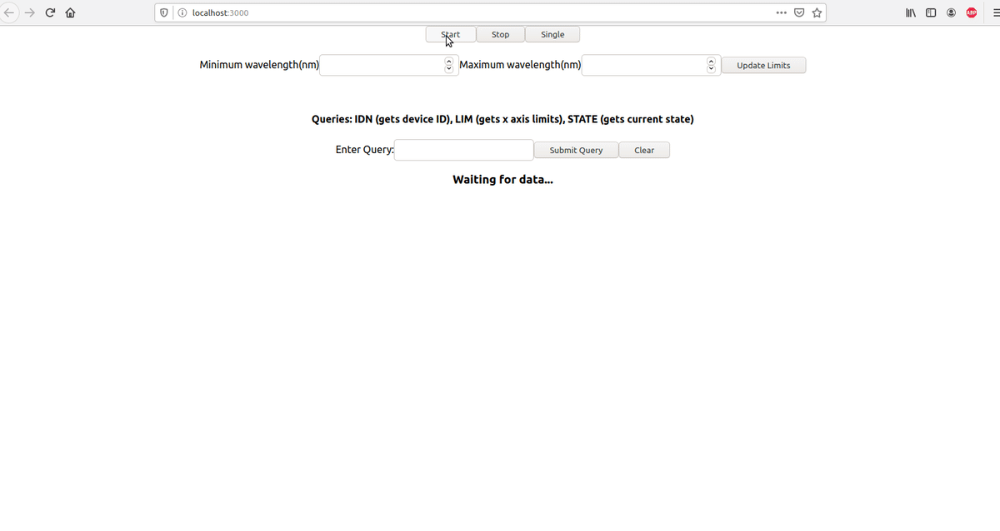

# Cloud OSA: My Submission to the Ciena Coding Challenge.

#### Implementation Details
* The backend is built in Python with Flask, and the front-end is in React.

## Demo 

In case you don't want to set up the application, here's a quick demo of all features.


  
## Get Started

1. Install all required python pacakges with*
   
```pip install -r requirements.txt```

*Note that your pip command may vary, such as pip3

2. Install all required JavaScript packages with:

```
cd client
npm install
cd ../
   ```
3. Start the server*:

```
python main.py
```
*Note that your python command may vary, such as python3

4. In a new terminal, start the client:
```
cd client
npm start
```